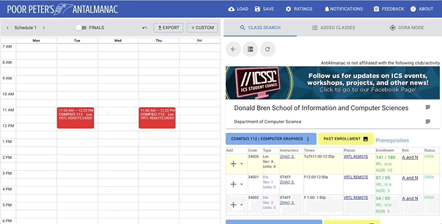

# web-crawler

A web crawler I made to collect data from UC Irvine for a class scheduling website. The script collects data about how fast classes fill up. The current project is up at [AntAlmanac.com](AntAlmanac.com). Here is a demo:

For this script, I used the BeautifulSoup library to parse the html of the UC Irvine course registration site.

	with urllib.request.urlopen(BASE_URL) as sauce:
				soup = bs.BeautifulSoup(sauce,'lxml')

Then I search through each course and find the maximum and current enrollment for each class.

	cap = classes[MAX_INDEX]
				enr = classes[ENR_INDEX]

This script was repeatedly run to collect data on how fast classes fill up at UC Irvine.
